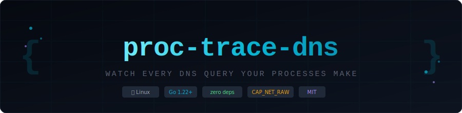
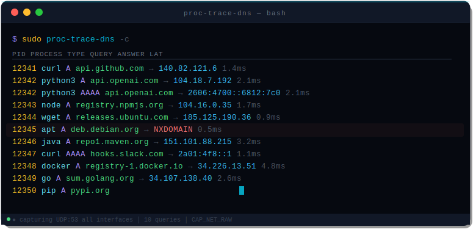
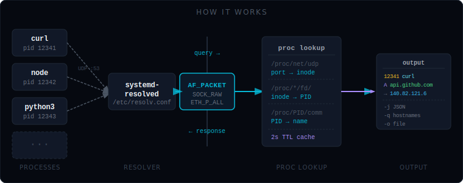
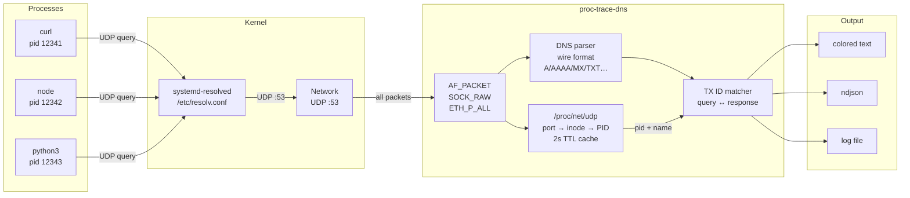

<div align="center">



<br/>

[](https://golang.org)
[](https://kernel.org)
[](#)
[](#requirements)
[](LICENSE)

**Watch every DNS query your processes make — in real time.**
Per-process attribution. Query types. Resolved IPs. NXDOMAIN errors. Latency.
One static binary. No packet capture tools. No config. No noise.

</div>

---

## 🖥️ Demo

<div align="center">

</div>

---

## ✨ Features

| | |
|---|---|
| 🔗 **Per-process attribution** | Every query is tagged with the PID and process name that made it |
| 📋 **Query type breakdown** | A, AAAA, CNAME, MX, TXT, PTR, SRV — see the full picture |
| ⚡ **Response latency** | Round-trip time per query — spot slow resolvers instantly |
| ❌ **Error surfacing** | NXDOMAIN, SERVFAIL, TIMEOUT shown alongside successful lookups |
| 🌐 **System-wide or filtered** | All traffic, or narrow to a PID, process name, or domain pattern |
| 📄 **JSON output** | `ndjson` mode for log pipelines, jq, Elasticsearch |
| 🔌 **No packet capture** | No libpcap, no tcpdump, no promiscuous mode |
| 📦 **Single static binary** | No runtime dependencies — copy and run |

---

## 🚀 Install

### Pre-built binary

```bash
# Linux amd64
curl -fsSL https://github.com/binRick/proc-trace-dns/releases/latest/download/proc-trace-dns-linux-amd64 \
  -o proc-trace-dns && chmod +x proc-trace-dns && sudo mv proc-trace-dns /usr/local/bin/

# Linux arm64 (Raspberry Pi, Graviton, etc.)
curl -fsSL https://github.com/binRick/proc-trace-dns/releases/latest/download/proc-trace-dns-linux-arm64 \
  -o proc-trace-dns && chmod +x proc-trace-dns && sudo mv proc-trace-dns /usr/local/bin/
```

### Build from source

```bash
git clone https://github.com/binRick/proc-trace-dns
cd proc-trace-dns
CGO_ENABLED=0 go build -trimpath -ldflags="-s -w" -o proc-trace-dns .
sudo mv proc-trace-dns /usr/local/bin/
```

### Docker cross-compile (no local Go required)

```bash
chmod +x build.sh && ./build.sh
# → dist/proc-trace-dns-linux-amd64
# → dist/proc-trace-dns-linux-arm64
```

### Run without `sudo`

```bash
# Grant CAP_NET_RAW once — then any user can run it
sudo setcap cap_net_raw+eip /usr/local/bin/proc-trace-dns
proc-trace-dns -n curl
```

---

## ⚡ Quick start

```bash
# Watch everything system-wide
sudo proc-trace-dns

# Filter to one process
sudo proc-trace-dns -n curl

# Filter to a domain
sudo proc-trace-dns -d amazonaws.com

# Trace one command, exit when it finishes
sudo proc-trace-dns -- curl -s https://example.com

# Audit what an install script resolves
sudo proc-trace-dns -q -- bash install.sh | sort -u

# JSON output
sudo proc-trace-dns -j | jq .

# Log to file in background
sudo proc-trace-dns -Qt -o /var/log/dns-queries.log &
```

---

## 📖 Usage

```
proc-trace-dns [flags] [-- CMD [args...]]

  -c          force ANSI color output
  -d PATTERN  only show queries matching this domain substring
  -f          flat output — no column alignment (good for grep/awk)
  -j          JSON output (one ndjson object per line)
  -n NAME,…   only show queries from these process names
  -o FILE     append output to FILE instead of stdout
  -p PID,…    only show queries from these PIDs
  -q          quiet — print only queried hostnames, one per line
  -Q          suppress error messages
  -t          show RFC3339 timestamp for each query
  -T TYPE,…   only show these record types (A, AAAA, MX, TXT, …)
```

### Output format

```
PID      PROCESS        TYPE   QUERY                                      → ANSWER          LATENCY
12341    curl           A      api.github.com                             → 140.82.121.6    1.4ms
12342    python3        AAAA   api.openai.com                             → 2606:4700::...  2.1ms
12345    apt            A      deb.debian.org                             → NXDOMAIN        0.5ms
```

### JSON output format

```json
{
  "pid": 12341,
  "name": "curl",
  "type": "A",
  "query": "api.github.com",
  "answers": ["140.82.121.6"],
  "rcode": "NOERROR",
  "latency_ms": 1.4
}
```

---

## 🔬 Examples

### Hunt NXDOMAIN failures

```bash
sudo proc-trace-dns -Qf | grep NXDOMAIN
```

```
12345  apt       A  deb.debian.org           → NXDOMAIN  0.5ms
12390  curl      A  internal.corp.invalid    → NXDOMAIN  0.3ms
```

### Audit a vendor installer

```bash
sudo proc-trace-dns -q -- bash vendor-install.sh | sort -u
```

```
api.segment.com
cdn.vendor.io
objects.githubusercontent.com
telemetry.vendor.io        ← 👀
```

### Map what your app resolves at startup

```bash
sudo proc-trace-dns -n myapp -j | jq -r .query | sort -u
```

### Watch only A/AAAA, skip the noise

```bash
sudo proc-trace-dns -T A,AAAA
```

### Catch beaconing (periodic unexpected lookups)

```bash
sudo proc-trace-dns -Qt -o /tmp/dns.log &
# later...
awk '{print $NF, $4}' /tmp/dns.log | sort | uniq -c | sort -rn | head -20
```

---

## 🏗️ Architecture

<div align="center">

</div>



---

## 🔧 How it works

**Step 1 — Capture:** opens a raw `AF_PACKET / SOCK_RAW` socket with `ETH_P_ALL`. Every frame arriving on every interface passes through. Frames where neither UDP source nor destination port is 53 are discarded in microseconds.

**Step 2 — Parse DNS:** strips the Ethernet → IPv4/IPv6 → UDP headers, then parses the DNS wire format: transaction ID, flags (QR bit, RCODE), question name + type, and all answer records (A, AAAA, CNAME, MX, TXT, PTR, SRV, NS).

**Step 3 — Attribute to a process:** for an outgoing query (UDP dst=53), the source port is an ephemeral port owned by the resolving process. We look it up:
1. **`/proc/net/udp`** (or `udp6`) → find the socket inode for that source port
2. **`/proc/*/fd/`** → readlink each fd, find which PID has `socket:[inode]`
3. **`/proc/<pid>/comm`** → process name

Results are cached with a 2-second TTL to avoid hammering `/proc` on every packet.

**Step 4 — Match query to response:** queries are held in a pending table keyed by DNS transaction ID (the 16-bit ID in the header). When the response arrives (UDP src=53, same TX ID), the entry is retrieved, latency computed, and the event emitted.

**No eBPF. No libpcap. No kernel modules. No ptrace.**

---

## 📋 Requirements

| | |
|---|---|
| **OS** | Linux (kernel 2.6+; any modern distro) |
| **Capability** | `CAP_NET_RAW` — or just `sudo` |
| **Architecture** | amd64, arm64 (pre-built); any Linux with Go 1.22+ (from source) |
| **macOS / Windows** | ❌ — AF_PACKET is Linux-only |

---

## 🔗 See also

- [proc-trace-exec](https://github.com/binRick/proc-trace-exec) — trace every `exec()` call system-wide
- [proc-trace-net](https://github.com/binRick/proc-trace-net) — trace network connections per-process
- [tls-ca-fetch](https://github.com/binRick/tls-ca-fetch) — extract CA certificates from any TLS server

---

## 📄 License

MIT
